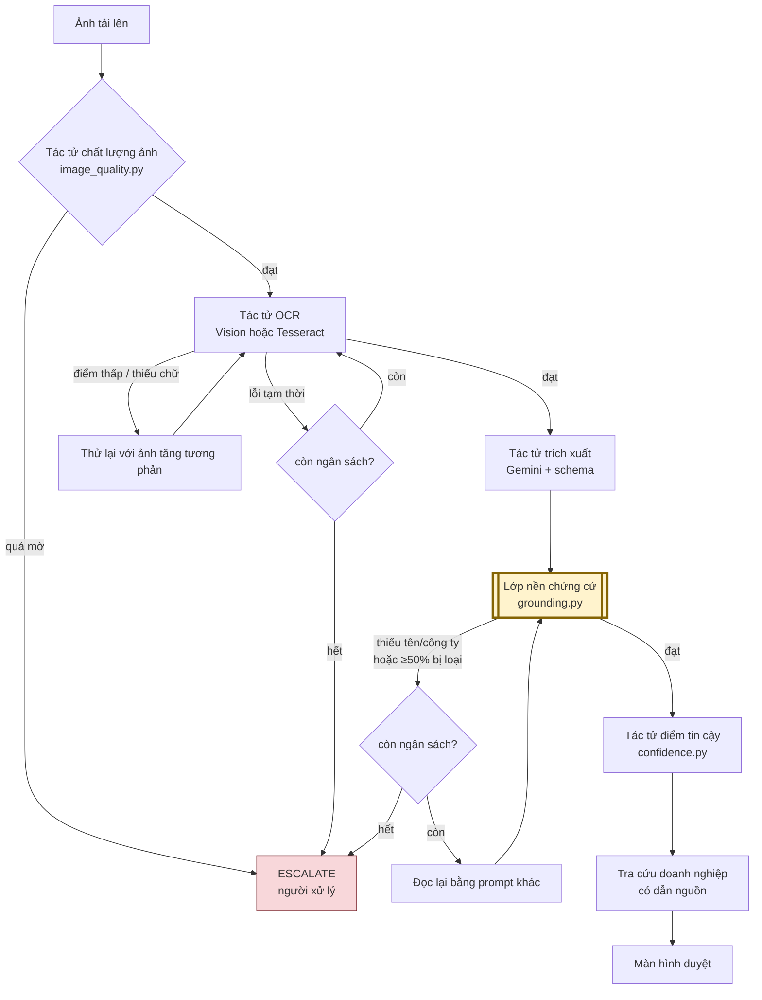

# Kiến trúc Agentic AI

Tài liệu này giải thích **vì sao** hệ thống được chia thành nhiều tác tử có
quyền quyết định, thay vì một đường ống chạy thẳng một lượt. Mọi mô tả ở đây
đối chiếu trực tiếp với mã nguồn — tên tệp và tên hàm được dẫn kèm để người
đọc kiểm chứng, không phải tin lời.

> **Trạng thái kiểm chứng (14/09/2026).** Các nhánh quyết định mô tả dưới đây
> đã có test tự động. Nhưng **chưa có số đo chất lượng trên ảnh chụp thật** —
> xem [phần 8](#8-những-gì-tài-liệu-này-chưa-chứng-minh-được). Đừng đọc tài
> liệu này như một báo cáo kết quả.

---

## 1. Vấn đề mà kiến trúc này giải quyết

Một danh thiếp không phải một biểu mẫu. Nó là ảnh chụp bằng điện thoại, cầm
tay, trong ánh sáng bất kỳ, của một tấm giấy có bố cục do nhà thiết kế tự do
đặt ra. Ba thứ có thể hỏng độc lập với nhau:

| Hỏng ở đâu | Biểu hiện | Đường ống một lượt sẽ làm gì |
| --- | --- | --- |
| Ảnh | Mờ, thiếu sáng, chói | Vẫn gọi OCR, tốn tiền, ra rác |
| OCR | Đọc sót nửa tấm thẻ | Vẫn đưa sang trích xuất, ra hồ sơ thiếu |
| Model trích xuất | **Bịa ra email không có trên thẻ** | Lưu thẳng vào cơ sở dữ liệu |

Dòng thứ ba là nguy hiểm nhất, vì nó **không có biểu hiện**. Một email bịa
trông y hệt một email thật. Người duyệt không có cách nào biết, trừ khi nhìn
lại ảnh gốc từng trường một — mà nếu phải làm vậy thì hệ thống chẳng tiết
kiệm được gì.

Kiến trúc agentic ở đây không phải để nghe hiện đại. Nó tồn tại vì **mỗi chỗ
hỏng cần một phản ứng khác nhau**, và phản ứng đó phải quyết định được tại
chỗ, dựa trên kết quả vừa nhận.

---

## 2. Toàn cảnh đường đi



Khối tô vàng là thứ quan trọng nhất trong cả sơ đồ. Phần 4 giải thích riêng.

---

## 3. Mô hình quyết định

Mọi tác tử chỉ được chọn một trong ba hành động, định nghĩa tại
[`agent_orchestrator.py`](../../backend/app/services/agent_orchestrator.py):

| Hành động | Nghĩa là | Khi nào |
| --- | --- | --- |
| `PROCEED` | Kết quả dùng được, đi tiếp | Mặc định |
| `RETRY` | Thử lại bằng **chiến lược khác** | Có lý do cụ thể, còn ngân sách |
| `ESCALATE` | Dừng tự động, giao cho người | Hết cách hoặc hết ngân sách |

### Vì sao chỉ có ba

Càng nhiều loại hành động thì càng khó trả lời câu hỏi *"vì sao bản quét này
ra như vậy?"*. Ba hành động là số tối thiểu để diễn đạt được "ổn", "để tôi
thử cách khác", và "tôi không làm được, cần người". Mọi tình huống đều rơi
vào một trong ba.

### Ngân sách thử lại: tối đa 2 lần cho mỗi bản quét

Đặt tại `reserve_retry()` trong
[`agent_runner.py`](../../backend/app/services/agent_runner.py):

```python
def reserve_retry(agent, reason, **metadata):
    if state["retries"] >= 2:
        return False
    state["retries"] += 1
    log(agent, Action.RETRY, reason, retry_number=state["retries"], **metadata)
    checkpoint()  # Persist reservation before the external call.
    return True
```

Ba chi tiết đáng chú ý, cả ba đều là quyết định có chủ ý:

1. **Ngân sách dùng chung cho cả bản quét**, không phải mỗi tác tử một ngân
   sách riêng. Một tấm thẻ tệ sẽ làm nhiều tác tử cùng muốn thử lại; ngân
   sách riêng sẽ cho phép chúng cộng dồn thành sáu, bảy lời gọi.

2. **Ghi sổ trước khi gọi.** `checkpoint()` nằm *trước* lời gọi ra ngoài, chứ
   không phải sau. Nếu tiến trình chết giữa chừng, lần chạy lại vẫn thấy lượt
   thử đó đã bị tiêu. Ngược lại — ghi sau — thì một bản quét gặp sự cố lặp có
   thể thử lại vô hạn, mỗi lần đều tốn tiền.

3. **Thử lại phải có chiến lược khác.** Gọi lại y hệt lời gọi vừa thất bại chỉ
   tốn thêm tiền để nhận cùng kết quả. Các chiến lược hiện có: `contrast` cho
   OCR, `alternative_prompt` cho trích xuất.

---

## 4. Grounding — lớp an toàn, không phải bước hậu xử lý

Đây là phần đáng đọc nhất của tài liệu.

### Quy tắc

> Mọi giá trị model trả về đều phải tìm được trong văn bản OCR. Không tìm
> được thì **bị loại**, nhưng vẫn **được ghi lại**.

Vế sau quan trọng ngang vế trước. Giá trị bị loại không biến mất im lặng — nó
đi vào báo cáo, để đo được model bịa nhiều hay ít. Một hệ thống âm thầm vứt
dữ liệu là một hệ thống không ai kiểm toán được.

### Vì sao hai nguồn phải độc lập

OCR đọc pixel. Model suy diễn. Đó là **hai nguồn khác nhau**, nên nguồn này
kiểm chứng được nguồn kia.

Nếu để model sinh ra cả văn bản thô lẫn các trường, cơ chế này mất sạch ý
nghĩa — thành ra lấy lời khai của một người ra kiểm chứng chính lời khai đó.
Model bịa ở cả hai bước thì grounding gật đầu cho qua.

Đây là lý do hệ thống chấp nhận thêm một nhà cung cấp OCR
([`tesseract.py`](../../backend/app/services/ocr/tesseract.py)) thay vì bỏ
OCR đi cho gọn. Tesseract đọc Kanji kém hơn Vision, nhưng nó vẫn **độc lập**
với Gemini — và tính độc lập mới là thứ không được phép đánh đổi.

### Vì sao không dùng phép kiểm tra chuỗi con

Đây là một lỗi thật đã bị bắt trong quá trình làm, bởi chính test của dự án.

Văn bản OCR chứa `taro.yamada@example.co.jp`. Model trả về
`yamada@example.co.jp` — một địa chỉ **không có trên tấm thẻ**. Phép kiểm tra
chuỗi con cho qua, vì chuỗi bịa đúng là một phần đuôi của chuỗi thật.

Cách sửa: cắt văn bản OCR thành các **token trọn vẹn** rồi so khớp cả token.

```python
def _tokens_of(kind: str, raw_text: str) -> set[str]:
    normalized = unicodedata.normalize("NFKC", raw_text)
    if kind == "email":
        return {norm_for_match(m) for m in _EMAIL_RE.findall(normalized)}
    ...
```

`NFKC` ở đó vì danh thiếp Nhật hay in chữ toàn rộng: `ＴＥＬ：０３-１２３４`
phải khớp được với `TEL:03-1234` mà model trả về.

### Ba mức phán quyết

| Phán quyết | Xử lý | Vì sao không gộp |
| --- | --- | --- |
| `exact` | Nhận | |
| `fuzzy` | Nhận, **có gắn cờ** | OCR sai một ký tự là chuyện thường; vứt đi thì mất dữ liệu đúng |
| `unverified` | **Loại**, vẫn ghi lại | Đây là thứ cần đếm để biết model bịa nhiều hay ít |

---

## 5. Tác tử điểm tin cậy

[`confidence.py`](../../backend/app/services/confidence.py) chấm **từng
trường**, không chấm cả bản quét. Điểm bắt đầu từ 1.0 và bị trừ theo bốn tín
hiệu:

| Tín hiệu | Trừ | Lý do |
| --- | --- | --- |
| Phán quyết grounding | −0.3 (fuzzy) / −0.8 (unverified) | Tín hiệu mạnh nhất, vì nó dựa trên chứng cứ pixel |
| Điểm tin cậy của chính OCR | −0.2 khi < 0.8 | Nhà cung cấp đã nói nó không chắc |
| Hệ chữ không khớp ngôn ngữ thẻ | −0.15 | Tên Nhật mà ra chữ Latin là dấu hiệu đọc sai |
| Sai định dạng theo trường | −0.5 (email) / −0.4 (điện thoại) | Kiểm được chắc chắn, không cần đoán |

Chấm theo trường chứ không theo bản quét, vì một tấm thẻ có thể đọc đúng tên
mà sai số điện thoại. Một điểm chung cho cả thẻ sẽ giấu mất điều đó, và người
duyệt không biết nên soi vào đâu.

**Một lỗi đã sửa, đáng ghi lại:** dải Unicode nhận diện hệ chữ trước đây bị
chép thành hai bản — một trong `confidence.py`, một trong `heuristic.py` — và
bản trong `confidence.py` **thiếu Hangul**. Hậu quả: tín hiệu thứ ba không bao
giờ kích hoạt cho thẻ tiếng Hàn. Nay cả hai dùng chung
[`languages.py`](../../backend/app/services/languages.py).

---

## 6. Bằng chứng không bao giờ bị ghi đè

`scans.raw_text` và `scans.extraction_json` của lần chạy thành công **đầu
tiên** là bất biến. Các lượt thử lại ghi vào ô riêng, có mốc kiểm riêng.

Vì sao: nếu lượt thử lại ghi đè lượt đầu, sẽ không còn cách nào trả lời câu
hỏi *"tự động sửa có làm kết quả tốt lên không?"* — dữ liệu để so sánh đã bị
chính hệ thống xóa mất. Việc chọn lượt tốt nhất do `rank()` làm, và nó chọn
theo thứ tự ưu tiên rõ ràng:

```python
def rank(grounding):
    counts = grounding["counts"]
    return (2 - len(missing(grounding)), -counts["unverified"],
            counts["exact"], counts["fuzzy"])
```

Đọc là: **ít thiếu trường quan trọng nhất** → **ít giá trị bị loại nhất** →
nhiều khớp chính xác nhất. Đặt `-unverified` trước `exact` là có chủ ý: một
lượt đọc ra nhiều trường nhưng một nửa bịa thì tệ hơn một lượt đọc ra ít mà
chắc.

---

## 7. So với đường ống một lượt

| | Một lượt | Kiến trúc này |
| --- | --- | --- |
| Ảnh mờ | Gọi OCR, tốn tiền, ra rác | Dừng trước khi gọi |
| OCR đọc sót | Ra hồ sơ thiếu | Thử lại với ảnh tăng tương phản |
| Model bịa dữ liệu | **Lưu thẳng vào CSDL** | Bị loại, có ghi lại để đếm |
| Trả lời "vì sao ra thế này?" | Không có gì để xem | Nhật ký quyết định từng bước |
| Chi phí xấu nhất mỗi thẻ | 1 lời gọi | 3 lời gọi (có trần cứng) |

Đánh đổi thành thật: kiến trúc này **đắt hơn và phức tạp hơn**. Nó chỉ đáng
khi cái giá của một dữ liệu sai cao hơn cái giá của hai lời gọi thừa. Với hồ
sơ đối tác — thứ sẽ được dùng để liên lạc làm ăn — một email sai là một email
gửi nhầm người.

---

## 8. Những gì tài liệu này chưa chứng minh được

Phần này tồn tại để tài liệu không bị đọc quá lên.

| Điều chưa biết | Vì sao chưa biết |
| --- | --- |
| Chất lượng đọc Kanji thật | Chưa có ảnh chụp thật — 0/40 |
| Ngưỡng `_FUZZY_THRESHOLD = 0.90` có đúng với Kanji không | Con số này chọn theo suy luận, chưa hiệu chỉnh trên dữ liệu |
| Nhánh tăng tương phản có thật sự cứu được ảnh mờ không | Chỉ mới test trên ảnh mờ nhân tạo |
| Ngưỡng của tác tử chất lượng ảnh | Mã nguồn tự ghi *"thresholds are uncalibrated rules"* |

**Đã chứng minh được:** Gemini chấp nhận schema `CardExtraction` — gọi thật
ngày 14/09/2026 với `gemini-3.5-flash`, xem
[4-kiem-chung/ocr-provider-notes.md](../4-kiem-chung/ocr-provider-notes.md).

476 test xanh chứng minh **mã nguồn tự nhất quán**. Nó không chứng minh hệ
thống đọc được danh thiếp thật. Hai điều đó khác nhau, và tài liệu này không
được phép làm nhòe ranh giới ấy.

---

## 9. Hướng phát triển

| Tác tử đề xuất | Việc nó làm | Vì sao chưa làm |
| --- | --- | --- |
| Dịch thuật | Dịch chức danh Nhật → Anh cho hồ sơ song ngữ | Cần thuật ngữ chuẩn theo ngành, chưa có nguồn |
| Gộp trùng | Quyết định hai hồ sơ có phải một người không | Cần đo tỷ lệ nhận nhầm trước, mà chưa có dữ liệu thật |
| Hiệu chỉnh ngưỡng | Tự điều chỉnh ngưỡng theo kết quả duyệt tay | Phải có đủ lượt duyệt tay mới học được gì |

Cả ba đều chặn ở cùng một chỗ: **cần số đo thật trước**. Thêm tác tử khi chưa
biết tác tử hiện có chạy tốt đến đâu là xây thêm tầng trên một nền chưa đo.

---

**Đọc tiếp:** [roadmap.md](roadmap.md) ·
[trien-khai-chi-tiet.md](trien-khai-chi-tiet.md) ·
[4-kiem-chung/](../4-kiem-chung/)
